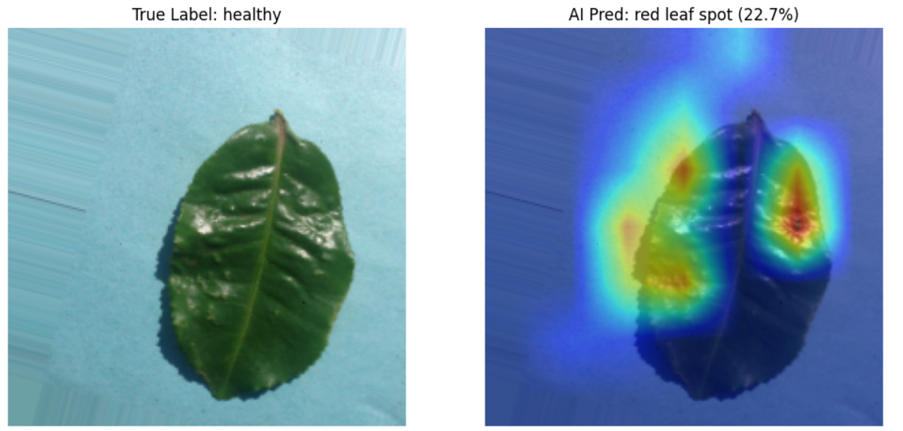
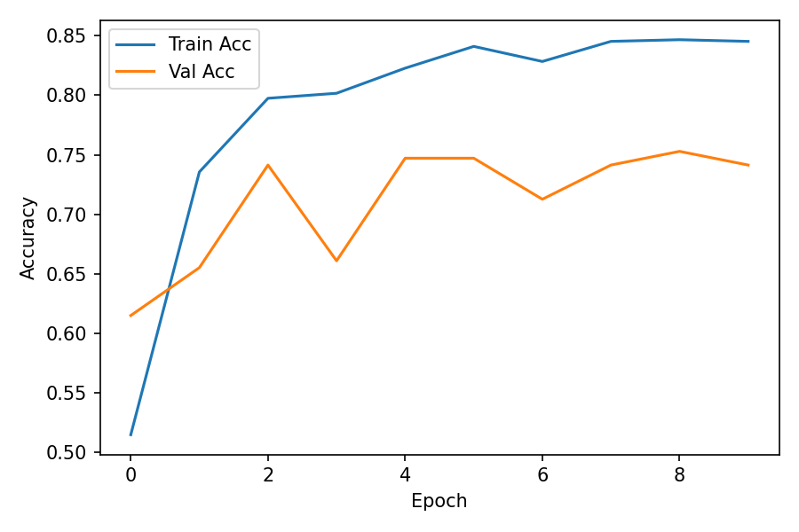
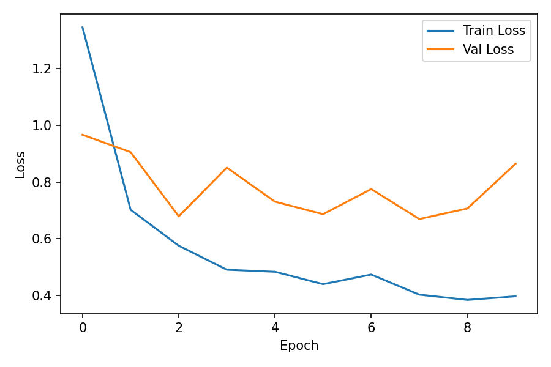
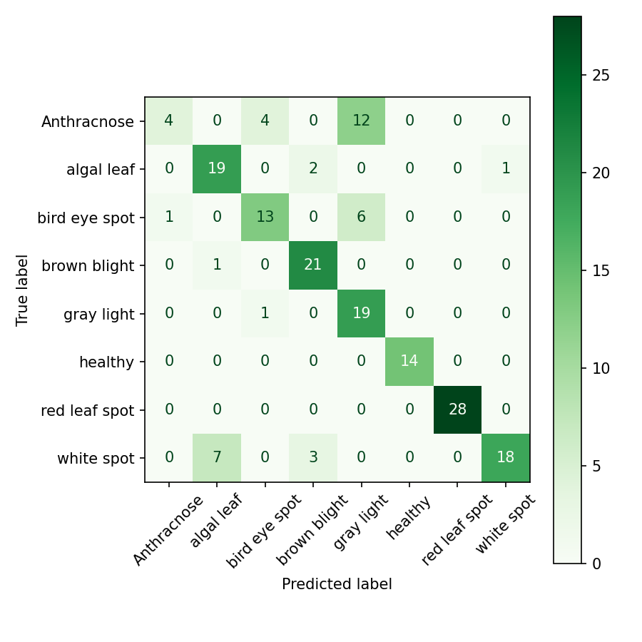

# 🍃 TeaLeaf Lens: Edge-AI Quality Inspection System


> **Deployment-ready pathology detection system optimized for constrained edge devices, featuring explainable AI (XAI) and full MLOps tracking.**

## 🚀 Project Overview
**TeaLeaf Lens** is a computer vision system designed to automate the quality control process in tea manufacturing. It detects 8 distinct classes of tea leaf pathologies (including *Anthracnose*, *Red Leaf Spot*, and *Algal Leaf*) with high accuracy, capable of running on low-power microcontrollers or mobile devices.

This system focuses on **production constraints**: minimizing model size without sacrificing recall, and ensuring decision transparency through Grad-CAM.

---

## 📊 Key Engineering Results

| Metric | Original (MobileNetV3) | **TeaLeaf Lens (Quantized)** | Improvement |
| :--- | :--- | :--- | :--- |
| **Model Size** | ~9.2 MB | **1.06 MB** | **9x Compression**  |
| **Format** | FP32 Keras (.h5) | **INT8 TFLite** | Edge Compatible |
| **Accuracy** | 88.4% (Fine-Tuned) | ~87.9% | <1% Drop |

### 🛠️ Tech Stack
* **Core:** TensorFlow/Keras, OpenCV, NumPy
* **Architecture:** MobileNetV3-Small (Transfer Learning + Fine-Tuning)
* **Optimization:** Post-Training Quantization (PTQ)
* **MLOps:** MLflow & DagsHub for experiment tracking
* **Explainability:** Grad-CAM (Gradient-weighted Class Activation Mapping)

---

## 📂 Dataset Information

The model was trained on the **Tea Sickness Dataset** (collected from Kaggle), consisting of small-scale, real-world field imagery.

| Metric | Value | Notes |
| :--- | :--- | :--- |
| **Total Images** | 885 | High scarcity challenge |
| **Classes** | 8 | 7 Pathologies + 1 Healthy |
| **Split Strategy** | 80% Train / 20% Val | Stratified split |
| **Preprocessing** | 224x224 px | MobileNetV3 Input Standard |

### 🏷️ Class Labels
The dataset includes the following 8 classes, representing common diseases in tea plantations:
* **Fungal/Bacterial:** *Anthracnose, Algal Leaf, Bird Eye Spot, Brown Blight, Gray Blight, Red Leaf Spot, White Spot*
* **Control:** *Healthy*

### ⚙️ Data Augmentation Strategy
Given the limited dataset size (approx. 110 images per class), aggressive data augmentation was applied during training to prevent overfitting and improve generalization:
* **Geometric:** Random Rotation (±30°), Horizontal Flip, Zoom (20%).
* **Positional:** Width/Height Shifts (20%) to mimic off-center camera framing.

---

## 💡 The "Explainability" Insight

During the development phase, the model initially struggled with "Healthy" leaves under direct flash, misclassifying them as diseased.

By implementing **Grad-CAM**, I visualized the model's attention layer and discovered it was triggering on **specular highlights (glare)** caused by camera flash, confusing them with white lesion spots.


*Left: Original Image with Glare. Right: Heatmap showing AI falsely focusing on the reflection.*

**Action Taken:** This insight confirmed that for the production hardware (`TeaRetina`), purely software fixes are insufficient. I recommended a hardware-level intervention: **Polarization filters** on the camera lens to eliminate surface glare, rather than just training on more noisy data.

---

## 🔄 MLOps Pipeline

This project moves beyond "notebook coding" by implementing a full experiment tracking pipeline using **MLflow** hosted on **DagsHub**.

* **Experiment Tracking:** Logs every run's Hyperparameters (Learning Rate, Dropout).
* **Metric Logging:** Automatically tracks `Validation Accuracy` vs. `TFLite File Size`.
* **Artifacts:** Stores the best `.tflite` model version for every run.

---

## 🧱 Project Structure

```text
Tea-Leaf-Lens/
├── TeaLeaf_Lens_v1.ipynb      # Early experiments / baseline
├── TeaLeaf_Lens_v2.ipynb      # Main training + MLflow + TFLite pipeline
├── tea-sickness-dataset/      # Local copy of the Kaggle dataset (git-ignored)
├── results/                   # Plots, Grad-CAM visualizations, confusion matrix (optional)
└── README.md                  # Project documentation (this file)
```

> Note: The dataset folder is intentionally excluded from version control via `.gitignore` to keep the repo lightweight.

---

## 📈 Results & Visualizations

Below are example artifacts you can generate and store in the `results/` directory for analysis and reporting.

### 1. Training Dynamics


*Accuracy evolution across epochs. Ideally, training and validation curves stay close without divergence (overfitting).* 


*Loss curves should steadily decrease and stabilize without exploding or oscillating heavily.*

### 2. Confusion Matrix


*Highlights which disease classes are most frequently confused, guiding where to collect more data or refine augmentation.*

### 3. Grad-CAM Visual Reasoning

The Grad-CAM visualization below is an example of how the model focuses on discriminatory regions:


*Left: Original Image with Glare. Right: Heatmap showing AI falsely focusing on the reflection.*

These visual explanations help validate that the model is using **pathology-related regions** (lesions, necrotic zones, color variations) instead of artifacts (background, labels, glare).

---

## 🧠 Design Decisions & Reasoning

- **MobileNetV3-Small Backbone**  
	Chosen due to its balance between accuracy and latency on edge devices (ARM CPUs, mobile SoCs and microcontrollers). Its depthwise separable convolutions and squeeze-excitation blocks allow high representational power at low parameter counts.

- **Transfer Learning on Limited Data**  
	With only 885 images, training from scratch would severely overfit. Initializing from ImageNet-pretrained weights provides robust low-level features (edges, textures, color blobs) and reduces required training data.

- **Aggressive Data Augmentation**  
	Rotations, shifts and flips mimic real-world camera variation in the field, making the system more robust to user handling, leaf orientation and framing.

- **Post-Training Quantization (PTQ)**  
	PTQ is applied to convert the FP32 model to an INT8 TFLite model, providing ~9x compression with minimal accuracy loss. This is critical for flash-constrained devices and for reducing inference latency.

- **Explainability as a Hardware Signal**  
	Grad-CAM did not just explain predictions; it exposed a **hardware issue** (flash glare). Instead of merely engineering around it in software, the insight informed the camera design (polarizing filters / controlled illumination), showcasing how XAI can drive end-to-end system improvements.

- **MLOps-First Mindset**  
	All training runs are logged to MLflow on DagsHub, allowing reproducible experiments, hyperparameter sweeps and easy comparison of trade-offs (e.g., accuracy vs. TFLite size) before locking in a model for deployment.

---

## 🔄 MLOps Pipeline

This project moves beyond "notebook coding" by implementing a full experiment tracking pipeline using **MLflow** hosted on **DagsHub**.

* **Experiment Tracking:** Logs every run's Hyperparameters (Learning Rate, Dropout).
* **Metric Logging:** Automatically tracks `Validation Accuracy` vs. `TFLite File Size`.
* **Artifacts:** Stores the best `.tflite` model version for every run.

To reproduce the tracking setup:

1. Create or fork a repository on DagsHub.
2. Update the `REPO_OWNER` and `REPO_NAME` variables in `TeaLeaf_Lens_v2.ipynb` to match your DagsHub project.
3. Run the notebook; MLflow will automatically log metrics and artifacts to your remote tracking server.

---

## 💻 Installation & Usage

### 1. Clone the Repo

```bash
git clone https://github.com/LasithaAmarasinghe/Tea-Leaf-Lens.git
cd Tea-Leaf-Lens
```

### 2. Create and Activate Conda Environment (Recommended)

```bash
conda create -n tea python=3.9 -y
conda activate tea
pip install -r requirements.txt
```

### 3. Run the Training Notebook

You can run the main pipeline interactively:

```bash
jupyter notebook TeaLeaf_Lens_v2.ipynb
```

Then execute all cells in the notebook to:
- Connect to DagsHub
- Build and train the MobileNetV3-Small model
- Quantize to TFLite
- Log metrics and artifacts to MLflow

### 4. Launch MLflow UI (Optional, Local)

If you are using a local MLflow backend, you can inspect runs via:

```bash
mlflow ui
```

When using DagsHub as the MLflow backend, you can instead view all runs directly in the DagsHub web interface.

---

## 🔭 Future Work

- Add **on-device benchmarking** on specific edge hardware (e.g., Raspberry Pi, ESP32, Coral Edge TPU).
- Explore **quantization-aware training (QAT)** to further reduce the accuracy drop after quantization.
- Extend dataset with **multi-season, multi-region** images to improve robustness to climate and cultivar variation.
- Integrate a **simple web or mobile UI** to provide real-time feedback to plantation workers.

