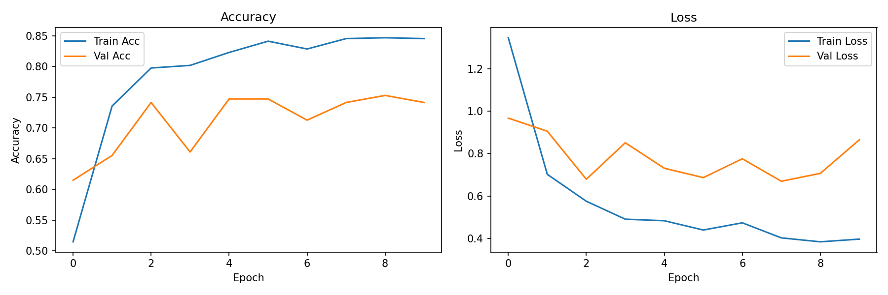
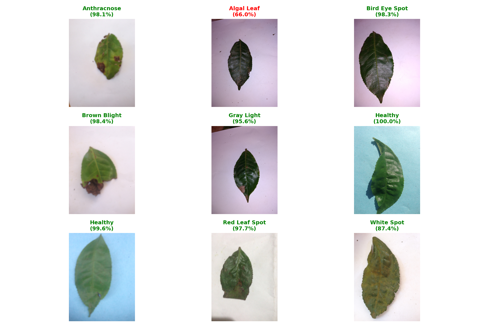
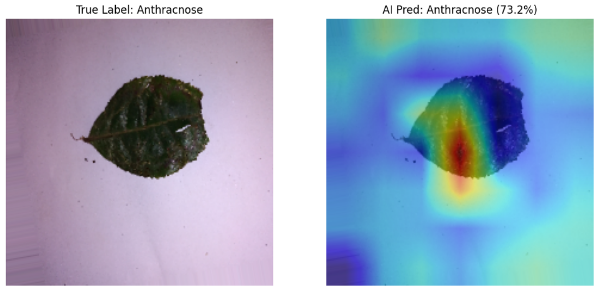
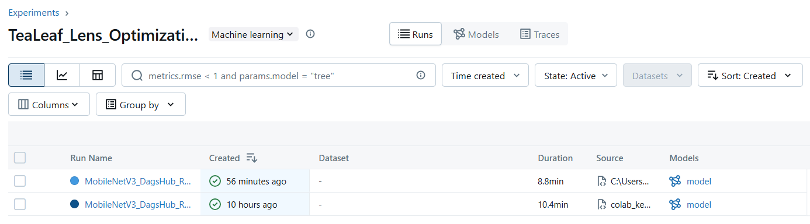
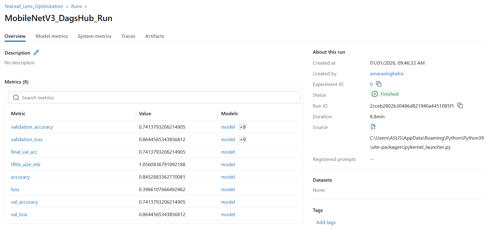
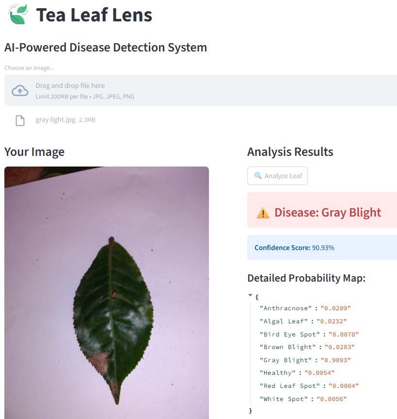
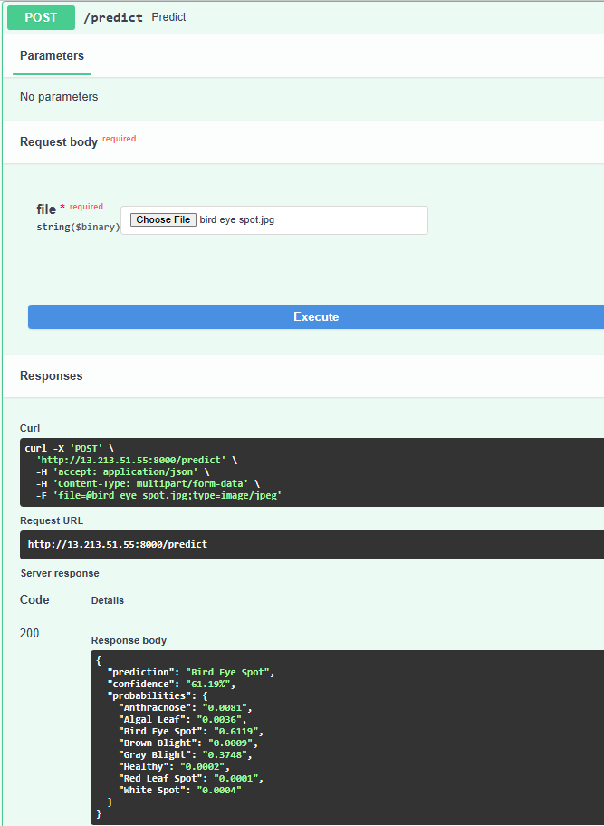

# 🍃 TeaLeaf Lens: Edge–Cloud Quality Inspection System


> **Deployment-ready pathology detection covering edge devices and an AWS-hosted FastAPI + Streamlit stack, backed by explainable AI and reproducible MLOps.**

## 🚀 Project Overview
**TeaLeaf Lens** automates tea-leaf quality control by detecting 8 disease classes (e.g., *Anthracnose*, *Red Leaf Spot*, *Algal Leaf*). The same INT8 TensorFlow Lite model powers:

* **Edge inference** on low-power microcontrollers and mobile hardware.
* **Cloud inference** on an AWS EC2 stack that exposes a REST API and Streamlit dashboard.

The system prioritizes compact models, transparent decisions via Grad-CAM, and full experiment traceability through MLflow/DagsHub.

### 🔑 Key Capabilities
* Sub-megabyte inference graph optimized for MobileNetV3-Small and PTQ.
* Grad-CAM driven diagnostics that informed both software tuning and optics recommendations.
* Remote serving pipeline hardened for t2.micro instances (swap provisioning, FastAPI concurrency, Streamlit UI).

---

## 🧱 System Architecture

```text
Data → Training (Keras + MLflow) → Quantization (TFLite) →
┌──────────────────────┐     ┌───────────────────────────┐
│ Edge Device          │     │ AWS EC2 Cloud Stack       │
│ • Microcontroller    │     │ • FastAPI backend (REST)  │
│ • Mobile deployment  │     │ • Streamlit UI            │
└──────────────────────┘     └───────────────────────────┘			 
```

### 🛠️ Tech Stack
* **Modeling:** TensorFlow/Keras, MobileNetV3-Small backbone, OpenCV, NumPy.
* **Optimization:** Post-Training Quantization → INT8 `.tflite`.
* **Explainability:** Grad-CAM for saliency-backed validation.
* **MLOps:** MLflow tracking hosted on DagsHub.
* **Cloud:** AWS EC2 (Ubuntu 24.04), FastAPI, Streamlit, Uvicorn, swap-tuned t2.micro setup.

---

## 📊 Key Engineering Results

| Metric | Original (MobileNetV3) | **TeaLeaf Lens (Quantized)** | Improvement |
| :--- | :--- | :--- | :--- |
| **Model Size** | ~9.2 MB | **1.06 MB** | **9x Compression** |
| **Format** | FP32 Keras (.h5) | **INT8 TFLite** | Edge Compatible |
| **Accuracy** | 78.4% (Fine-Tuned) | ~77.9% | <1% Drop |

---

## 📂 Dataset Information

The model uses the **Tea Sickness Dataset** (Kaggle, natural field imagery).

| Metric | Value | Notes |
| :--- | :--- | :--- |
| **Total Images** | 885 | High scarcity challenge |
| **Classes** | 8 | 7 Pathologies + 1 Healthy |
| **Split Strategy** | 80% Train / 20% Val | Stratified split |
| **Preprocessing** | 224×224 px | MobileNetV3 Input Standard |

### 🏷️ Class Labels
* **Fungal/Bacterial:** *Anthracnose, Algal Leaf, Bird Eye Spot, Brown Blight, Gray Blight, Red Leaf Spot, White Spot*
* **Control:** *Healthy*

### ⚙️ Data Augmentation
Aggressive augmentation offsets the small dataset (~110 images/class):
* **Geometric:** Random rotation (±30°), horizontal flip, 20% zoom.
* **Positional:** 20% width/height shifts to mimic imprecise framing.

---

## 📈 Results & Visualizations

Artifacts live under `results/` for audit trails and reporting.

1. **Training Dynamics** – accuracy/loss curves for overfitting diagnosis.  
	
2. **Confusion Matrix** – highlights confusing pathology pairs.  
	
3. **Inference Grid** – batch predictions with confidences generated via `inference.ipynb`.  
	
4. **Grad-CAM Visual Reasoning** – success/failure attention heatmaps.  
	<div>
	<div>
		
		<div><em>Misclassified (glare) – the model locks onto specular reflections.</em></div>
	</div>
	<div>
		
		<div><em>Correctly classified – activation centered on the lesion site.</em></div>
	</div>
	</div>

---

## 💡 Explainability Insight

Grad-CAM exposed that "Healthy" leaves shot with flash were flagged as diseased because the network associated specular highlights with white lesion spots.


**Mitigation:** Beyond collecting more data, the deployment guide now recommends **polarizing filters** (TeaRetina camera) to suppress glare, proving how XAI can influence optical design—not just model tuning.

---

## 🧠 Design Decisions

* **MobileNetV3-Small Backbone** – optimal accuracy/latency compromise for ARM-class CPUs.
* **Transfer Learning** – ImageNet initialization prevents overfitting on 885 samples.
* **Aggressive Augmentation** – simulates user handling variance.
* **Post-Training Quantization** – compresses to 1.06 MB with negligible accuracy loss.
* **Explainability Feedback Loop** – Grad-CAM drives both model debugging and hardware guidance.
* **MLOps-First Mindset** – every experiment logged to MLflow/DagsHub for reproducibility.

---

## 🔄 MLOps Pipeline

* **Experiment Tracking:** Hyperparameters, metrics, and artifacts versioned via MLflow (remote backend on DagsHub).
* **Metric Logging:** Correlates validation accuracy with `.tflite` footprint to enforce device budgets.
* **Artifacts:** Best INT8 model per run kept for auditing.

To reproduce:
1. Fork/create a DagsHub repo.
2. Set `REPO_OWNER` and `REPO_NAME` inside `TeaLeaf_Lens_v2.ipynb`.
3. Execute the notebook; MLflow automatically syncs runs, metrics, and TFLite artifacts.

### 🧪 Experiment Dashboard



---

## 🧱 Project Structure

```text
TEA-LEAF-LENS/
├── mlruns/                 # MLflow artifacts
├── results/                # Plots, Grad-CAM visuals, dashboards
├── tea-sickness-dataset/   # Kaggle dataset (ignored in git)
├── test images/            # Held-out inference samples
├── app.py                  # FastAPI backend
├── ui.py                   # Streamlit frontend
├── inference.ipynb
├── TeaLeaf_Lens_v1.ipynb
├── TeaLeaf_Lens_v2.ipynb   # Main training + MLflow notebook
├── tealeaf.tflite          # Quantized model
├── requirements.txt
└── README.md
```

> Dataset directories stay out of version control via `.gitignore` to keep the repo portable.

---

## ☁️ Cloud Deployment & Web Interface

The AWS deployment mirrors the edge graph for centralized inference and provides both human and machine interfaces.

### 🏗️ Cloud Architecture
* **Provider:** AWS EC2 (Ubuntu 24.04 LTS, `t2.micro`).
* **Backend:** FastAPI + Uvicorn exposing REST + auto Swagger docs.
* **Frontend:** Streamlit dashboard for analysts and agronomists.
* **Model Runtime:** TensorFlow Lite interpreter with server-side preprocessing.
* **Ops Hardening:** 2 GB swap file ensures TensorFlow installs cleanly on 1 GB RAM nodes.

### 🚀 Features
* **REST API:** Documented via Swagger, portable for mobile/IoT integrations.
* **Real-time Inference:** Sub-second latency thanks to INT8 execution.
* **Interactive UI:** Upload, preview, and inspect per-class confidences.
* **Robust Preprocessing:** Validates tensor shapes to match MobileNetV3 expectations.

### 📸 Interface

| **Interactive Web UI (Streamlit)** | **API Documentation (Swagger UI)** |
|:----------------------------------:|:----------------------------------:|
|  |  |
| *Real-time classification dashboard* | *Auto-generated API contract* |

---

## ☁️ AWS Deployment Walkthrough

Here is the end-to-end process used to stand up TeaLeaf Lens on AWS.

### Step 1: Launch the EC2 Instance
1. Log into the **AWS Console** and open **EC2**.
2. Click **Launch Instance** and set **Name** = `Tea-Leaf-Inference-Server`.
3. Choose **Ubuntu Server 24.04 LTS** (Free Tier eligible) as the AMI.
4. Select instance type `t2.micro` (1 vCPU, 1 GB RAM).
5. Create/download an SSH key pair (e.g., `my-aws-key.pem`).

### Step 2: Configure Security Group (Firewall)
Allow traffic needed for remote management, API inference, and the UI.

| Type | Port | Source | Purpose |
| :--- | :--- | :--- | :--- |
| **SSH** | 22 | `0.0.0.0/0` | Remote terminal access |
| **Custom TCP** | 8000 | `0.0.0.0/0` | FastAPI backend |
| **Custom TCP** | 8501 | `0.0.0.0/0` | Streamlit UI |

Restrict sources to your corporate CIDR if required by policy.

### Step 3: Connect via SSH
```bash
# Set key permissions (Linux/macOS)
chmod 400 my-aws-key.pem
# Replace with the EC2 public IP or DNS
ssh -i "my-aws-key.pem" ubuntu@<YOUR-EC2-PUBLIC-IP>
```

### Step 4: Prepare the Environment
Once on the server:

1. **Update the OS**
	```bash
	sudo apt update && sudo apt upgrade -y
	```
2. **Provision Swap (critical for t2.micro + TensorFlow)**
	```bash
	sudo fallocate -l 2G /swapfile
	sudo chmod 600 /swapfile
	sudo mkswap /swapfile
	sudo swapon /swapfile
	```
3. **Install Python Tooling**
	```bash
	sudo apt install python3-pip python3-venv -y
	```

### Step 5: Deploy the Application
1. **Clone the Repository**
	```bash
	git clone https://github.com/LasithaAmarasinghe/Tea-Leaf-Lens.git
	cd Tea-Leaf-Lens
	```
2. **Create Virtual Environment + Install Dependencies**
	```bash
	python3 -m venv venv
	source venv/bin/activate
	pip install tensorflow-cpu fastapi uvicorn streamlit requests pillow python-multipart
	```
3. **Start Backend and Frontend (persist via nohup)**
	```bash
	nohup uvicorn app:app --host 0.0.0.0 --port 8000 > backend.log 2>&1 &
	nohup streamlit run ui.py --server.port 8501 > frontend.log 2>&1 &
	```

### Step 6: Validate the Deployment
* Streamlit UI: `http://<YOUR-EC2-PUBLIC-IP>:8501`
* FastAPI Swagger: `http://<YOUR-EC2-PUBLIC-IP>:8000/docs`

Both services can be monitored through `backend.log` and `frontend.log` (tail the files to verify uptime).

---

## 💻 Local Installation & Usage

1. **Clone the Repo**  
	```bash
	git clone https://github.com/LasithaAmarasinghe/Tea-Leaf-Lens.git
	cd Tea-Leaf-Lens
	```
2. **Create Environment** (Conda recommended)  
	```bash
	conda create -n tea python=3.9 -y
	conda activate tea
	pip install -r requirements.txt
	```
3. **Run Training Notebook**  
	```bash
	jupyter notebook TeaLeaf_Lens_v2.ipynb
	```
	Execute all cells to connect to DagsHub, fine-tune MobileNetV3-Small, quantize to TFLite, and log MLflow artifacts.
4. **Optional Local MLflow UI**  
	```bash
	mlflow ui
	```
	Inspect runs locally or on DagsHub depending on your backend URL.

---

## 🔭 Future Work

* Explore **quantization-aware training (QAT)** to squeeze additional accuracy from INT8 deployment.
* Grow the dataset with **multi-season, multi-region** samples for better climate/cultivar robustness.

